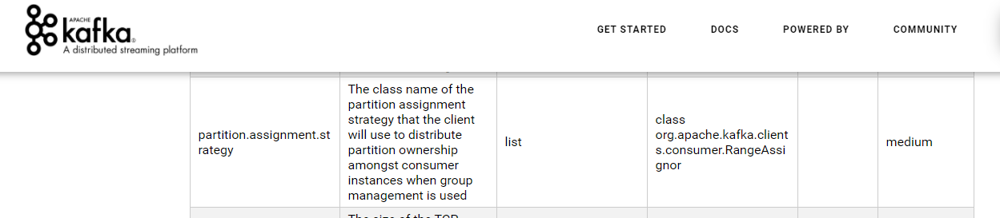

# troubles

## 多个消费组，会不会重复消费消息？

每个消费组不会重复消费。

每个消费组都会消费到全量的数据。

消费组可以保证消费组中的消费者不会重复消费消息。

## 怎么保证全局消费顺序FIFO？比如秒杀场景，应该是先发消息的更有资格秒到商品。

首先，Kafka不适合用在业务场合。如秒杀场景。

其次，秒杀也不需要全局有序。秒杀几百件商品，Kafka单机并发量几十上百万，足以应付。

如果需要全局严格有序，消除集群的横向扩展，只保留一个分区，一个生产者，一个消费者即可。

## 关于偏移量提交，既然自动提交也会在poll的时候提交偏移量，那为什么再平衡之后还有可能存在重复消费的情况？

消费者自动提交偏移量默认是5秒。

如果0秒的时候消费者读取了11-20消息，此时Kafka记录的该消费者偏移量为10

5秒的时候提交偏移量为20，下次消费从21开始

如果在4秒的时候消费者退出，重启，则Kafka记录的消费者偏移量依然是10，不是20，因为还没有到提交偏移量的时候消费者退出了。

重启后，消费者获取消息，就从11开始，也就是：第一次消费11-20，第二次消费还是从11开始，还是11-20，11-20就会有消息重复消费。

再平衡不是引起消息重复消费的原因，如何提交偏移量才是。

## 为什么手动分配分区时，初始偏移量不是0？

回答：初始偏移量为什么是0？

消息会过期，会删除。

消息的偏移量不是简单的0，1，2。

因为分区文件在一个文件夹中，文件夹中的日志文件分段，便于管理。

一般使用Kafka的时候，下游组件经常自己管理Kafka偏移量，这样更加灵活。

手动分配分区是一个比较底层的操作，偏移量需要自己记录下来。

## 为什么重平衡一定要让整个消费组停止工作，不能边工作边分配吗

看具体的Rebalance策略：

按区间分配

轮询分配

粘性分配

如果是按区间分配或者轮询分配，每次在Rebalance的时候，需要消费组中的所有消费者参与，**上一个Rebalance的结果元数据会删除**。

Rebalance结束后生成新的分区分配元数据，接着消费主题分区数据。

如果是粘性分配，会部分保留上一次Rebalance的元数据，只需要将变动的部分做处理即可。

如此可以避免Rebalance涉及到的消费者太多，减小Rebalance对消费的影响。

目前Kafka的默认值是RangeAssignor，也就是按照区间给消费组中的消费者分配分区。也就是消费组中所有消费者都需要参与进来，进行分区的分配。

在Rebalance期间，消费组的消费暂停。

