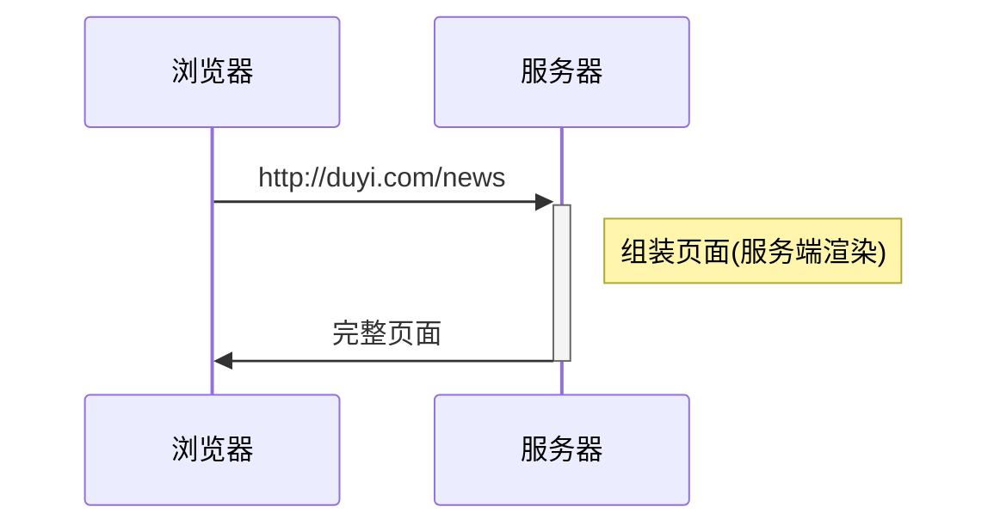
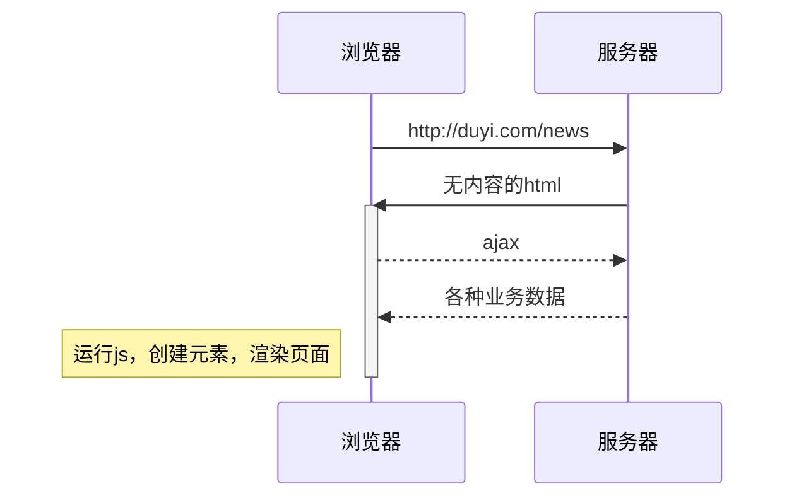
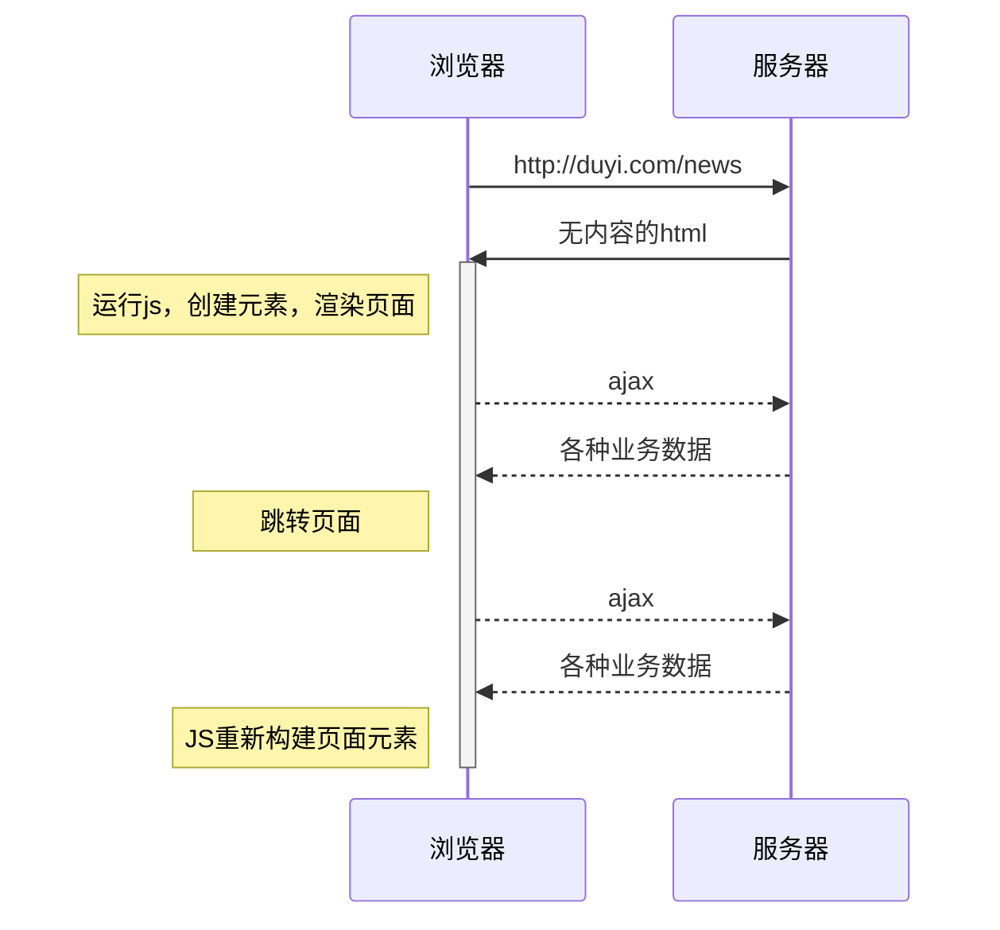
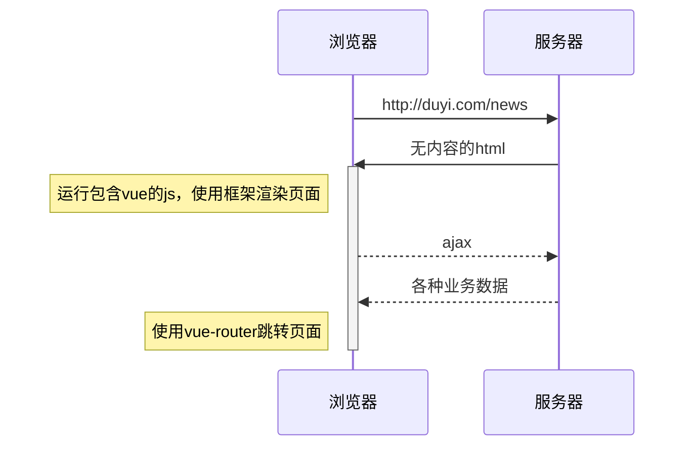

# Vue

## 前端框架的由来

> vue官网：https://cn.vuejs.org/
>

**服务端渲染**



------

**前后端分离**



---------

**单页应用**



---------

**vue框架**




## 核心概念

### 注入


vue会将以下配置注入到vue实例：

- data：和界面相关的数据
- computed：通过已有数据计算得来的数据，将来详细讲解
- methods：方法

> 模板中可以使用vue实例中的成员

### 虚拟DOM树

直接操作真实的DOM会引发严重的效率问题，vue使用虚拟DOM（vnode）的方式来描述要渲染的内容

vnode是一个**普通的**JS对象，用于描述界面上应该有什么，比如：

```js
var vnode = {
  tag: "h1",
  children: [
    { tag: undefined, text: "第一个vue应用：Hello World"}
  ]
}
```

上面的对象描述了：

```
有一个标签名为h1的节点，它有一个子节点，该子节点是一个文本，内容为「第一个vue应用：Hello World」
```

**vue模板并不是真实的DOM，它会被编译为虚拟DOM**

```html
<div id="app">
  <h1>第一个vue应用：{{title}}</h1>
  <p>作者：{{author}}</p>
</div>
```

上面的模板会被编译为类似下面结构的虚拟DOM

```js
{
  tag: "div",
  children: [
    { tag: "h1", children: [ { text: "第一个vue应用：Hello World" } ] },
    { tag: "p", children: [ { text: "作者：袁" } ] }
  ]
}
```

虚拟DOM树会最终生成为真实的DOM树


当数据变化后，将引发重新渲染，vue会比较新旧两棵vnode tree，找出差异，然后仅把差异部分应用到真实dom tree中


**可见，在vue中，要得到最终的界面，必须要生成一个vnode tree**

vue通过以下逻辑生成vnode tree：


**注意：虚拟节点树必须是单根的**

### 挂载

将生成的真实DOM树，放置到某个元素位置，称之为**挂载**

挂载的方式：

1. 通过`el:"css选择器"`进行配置
2. 通过`vue实例.$mount("css选择器")`进行配置

### 完整流程


组件的出现是为了实现以下两个目标：

1. 降低整体复杂度，提升代码的可读性和可维护性
2. 提升局部代码的可复用性

绝大部分情况下，一个组件就是页面中某个区域，组件包含该区域的：

- 功能（JS代码）

- 内容（模板代码）

- 样式（CSS代码）

  > 要在组件中包含样式，需要构建工具的支撑

## 组件开发

### 创建组件

组件是根据一个普通的配置对象创建的，所以要开发一个组件，只需要写一个配置对象即可

该配置对象和vue实例的配置是**几乎一样**的

```js
//组件配置对象
var myComp = {
  data(){
    return {
      // ...
    }
  },
  template: `....`
}
```

值得注意的是，组件配置对象和vue实例有以下几点差异：

- 无`el`
- `data`必须是一个函数，该函数返回的对象作为数据
- 由于没有`el`配置，组件的虚拟DOM树必须定义在`template`或`render`中


### 注册组件

注册组件分为两种方式，一种是**全局注册**，一种是**局部注册**

#### 全局注册

一旦全局注册了一个组件，整个应用中任何地方都可以使用该组件


全局注册的方式是：

```js
// 参数1：组件名称，将来在模板中使用组件时，会使用该名称
// 参数2：组件配置对象
// 该代码运行后，即可在模板中使用组件
Vue.component('my-comp', myComp)
```

在模板中，可以使用组件了

```html
<my-comp />
<!-- 或 -->
<my-comp></my-comp>
```


> 但在一些工程化的大型项目中，很多组件都不需要全局使用。
> 比如一个登录组件，只有在登录的相关页面中使用，如果全局注册，将导致构建工具无法优化打包
> **因此，除非组件特别通用，否则不建议使用全局注册**


#### 局部注册

局部注册就是哪里要用到组件，就在哪里注册


局部注册的方式是，在要使用组件的组件或实例中加入一个配置：

```js
// 这是另一个要使用my-comp的组件
var otherComp = {
  components:{
    // 属性名为组件名称，模板中将使用该名称
    // 属性值为组件配置对象
    "my-comp": myComp
  },
  template: `
    <div>
      <!-- 该组件的其他内容 -->
      <my-comp></my-comp>
    </div>
  `;
}
```

### 应用组件

在模板中使用组件特别简单，把组件名当作HTML元素名使用即可。

但要注意以下几点：

1. **组件必须有结束**

组件可以自结束，也可以用结束标记结束，但必须要有结束

下面的组件使用是错误的：

```html
<my-comp>
```

2. **组件的命名**

无论你使用哪种方式注册组件，组件的命名需要遵循规范。

组件可以使用`kebab-case 短横线命名法`，也可以使用`PascalCase 大驼峰命名法`

下面两种命名均是可以的

```js
var otherComp = {
  components:{
    "my-comp": myComp,  // 方式1
    MyComp: myComp //方式2
  }
}
```

> 实际上，使用`小驼峰命名法 camelCase`也是可以识别的，只不过不符合官方要求的规范

使用`PascalCase`方式命名还有一个额外的好处，即可以在模板中使用两种组件名

```js
var otherComp = {
  components:{
    MyComp: myComp
  }
}
```

模板中：

```html
<!-- 可用 -->
<my-comp />
<MyComp />
```

因此，在使用组件时，为了方便，往往使用以下代码：

```js
var MyComp = {
  //组件配置
}

var OtherComp = {
  components:{
    MyComp // ES6速写属性
  }
}
```

## 组件树

一个组件创建好后，往往会在各种地方使用它。它可能多次出现在vue实例中，也可能出现在其他组件中。

于是就形成了一个组件树


## 向组件传递数据

大部分组件要完成自身的功能，都需要一些额外的信息

比如一个头像组件，需要告诉它头像的地址，这就需要在使用组件时向组件传递数据

传递数据的方式有很多种，最常见的一种是使用**组件属性 component props**

首先在组件中申明可以接收哪些属性:

```js
var MyComp = {
  props:["p1", "p2", "p3"],
  // 和vue实例一样，使用组件时也会创建组件的实例
  // 而组件的属性会被提取到组件实例中，因此可以在模板中使用
  template: `
    <div>
      {{p1}}, {{p2}}, {{p3}}
    </div>
  `
}
```

在使用组件时，向其传递属性：

```js
var OtherComp = {
  components: {
    MyComp
  },
  data(){
    return {
      a:1
    }
  },
  template: `
    <my-comp :p1="a" :p2="2" p3="3"/>
  `
}
```

**注意：在组件中，属性是只读的，绝不可以更改，这叫做单向数据流**


## 路由

> vue-router 官网：https://router.vuejs.org/zh/


1. **如何根据地址中的路径选择不同的组件？**
2. **把选择的组件放到哪个位置？**
3. **如何无刷新的切换组件？**

### 路由插件

```shell
# 为了保证和课程一致，请安装3.4.9版本
npm i vue-router@3.4.9
```

路由插件的使用

```js
import Vue from 'vue'
import VueRouter from 'vue-router'

Vue.use(VueRouter); // Vue.use(插件)  在Vue中安装插件

const router = new VueRouter({
  // 路由配置
})
new Vue({
  ...,
  router
})
```

### 基本使用

```js
// 路由配置
const router = new VueRouter({
  routes: [
    // 路由规则
    // 当匹配到路径 /foo 时，渲染 Foo 组件
    { path: '/foo', component: Foo },
    // 当匹配到路径 /bar 时，渲染 Bar 组件
    { path: '/bar', component: Bar },
  ],
});
```

```html
<!-- App.vue -->
<div class="container">
  <div>
    <!-- 公共区域 -->
  </div>
  <div>
    <!-- 页面区域 -->
    <!-- vue-router 匹配到的组件会渲染到这里 -->
    <RouterView />
  </div>
</div>
```

### 路由模式

路由模式决定了：

1. 路由从哪里获取访问路径
2. 路由如何改变访问路径

`vue-router`提供了三种路由模式：

1. hash：默认值。路由从浏览器地址栏中的 hash 部分获取路径，改变路径也是改变的 hash 部分。该模式兼容性最好。

   ```
   http://localhost:8081/#/blog  -->  /blog
   http://localhost:8081/about#/blog  --> /blog
   ```

2. history：路由从浏览器地址栏的`location.pathname`中获取路径，改变路径使用的 H5 的`history api`。该模式可以让地址栏最友好，但是需要浏览器支持`history api`

   ```
   http://localhost:8081/#/blog  -->  /
   http://localhost:8081/about#/blog  --> /about
   http://localhost:8081/blog  --> /blog
   ```

3. abstract：路由从内存中获取路径，改变路径也只是改动内存中的值。这种模式通常应用到非浏览器环境中。

   ```shell
   内存： /			-->   /
   内存： /about	--> /about
   内存： /blog	  --> /blog
   ```

### 导航

`vue-router`提供了全局的组件`RouterLink`，它的渲染结果是一个`a`元素

```html
<RouterLink to="/blog">文章</RouterLink>
<!-- mode:hash 生成 -->
<a href="#/blog">文章</a>
<!-- mode:history 生成 -->
<!-- 为了避免刷新页面，vue-router实际上为它添加了点击事件，并阻止了默认行为，在事件内部使用hitory api更改路径 -->
<a href="/blog">文章</a>
```


### 激活状态

默认情况下，`vue-router`会用 **当前路径** 匹配 **导航路径** ：

- 如果当前路径是以导航路径开头，则算作匹配，会为导航的 a 元素添加类名`router-link-active`
- 如果当前路径完全等于导航路径，则算作精确匹配，会为导航的 a 元素添加类名`router-link-exact-active`

例如，当前访问的路径是`/blog`，则：

| 导航路径 | 类名                                        |
| -------- | ------------------------------------------- |
| /        | router-link-active                          |
| /blog    | router-link-active router-link-exact-active |
| /about   | 无                                          |
| /message | 无                                          |

可以为组件`RouterLink`添加 bool 属性`exact`，将匹配规则改为：必须要精确匹配才能添加匹配类名`router-link-active`

例如，当前访问的路径是`/blog`，则：

| 导航路径 | exact | 类名                                        |
| -------- | ----- | ------------------------------------------- |
| /        | true  | 无                                          |
| /blog    | false | router-link-active router-link-exact-active |
| /about   | true  | 无                                          |
| /message | true  | 无                                          |

例如，当前访问的路径是`/blog/detail/123`，则：

| 导航路径 | exact | 类名               |
| -------- | ----- | ------------------ |
| /        | true  | 无                 |
| /blog    | false | router-link-active |
| /about   | true  | 无                 |
| /message | true  | 无                 |

另外，可以通过`active-class`属性更改匹配的类名，通过`exact-active-class`更改精确匹配的类名

## 命名路由

使用命名路由可以解除系统与路径之间的耦合

```js
// 路由配置
const router = new VueRouter({
  routes: [
    // 路由规则
    // 当匹配到路径 /foo 时，渲染 Foo 组件
    { name: 'foo', path: '/foo', component: Foo },
    // 当匹配到路径 /bar 时，渲染 Bar 组件
    { name: 'bar', path: '/bar', component: Bar },
  ],
});
```

```html
<!-- 向to属性传递路由信息对象 RouterLink会根据你传递的信息以及路由配置生成对应的路径 -->
<RouterLink :to="{ name:'foo' }">go to foo</RouterLink>
```

## 组件生命周期


### 常见应用

> 不要死记硬背，要根据具体情况灵活处理

### 加载远程数据

```js
export default {
  data(){
    return {
      news: []
    }
  },
  async created(){
    this.news = await getNews();
  }
}
```

### 直接操作DOM

```js
export default {
  data(){
    return {
      containerWidth:0,
    	containerHeight:0
    }
  },
  mounted(){
    this.containerWidth = this.$refs.container.clientWidth;
    this.containerHeight = this.$refs.container.containerHeight;
  }
}
```

### 启动和清除计时器

```js
export default {
  data(){
    return {
      timer: null
    }
  },
  created(){
    this.timer = setInterval(()=>{
     ... 
    }, 1000)
  },
  destroyed(){
    clearInterval(this.timer);               
  }
}
```

## 定义指令

### 全局定义

```js
// 指令名称为：mydirec1
Vue.directive('mydirec1', {
  // 指令配置
})

// 指令名称为：mydirec2
Vue.directive('mydirec2', {
  // 指令配置
})
```

之后，所有的组件均可以使用`mydirec1`和`mydirec2`指令

```vue
<template>
  <!-- 某个组件代码 -->
  <div>
    <MyComp v-mydirec1="js表达式" />
    <div v-mydirec2="js表达式">
      ...
    </div>
    
  </div>
</template>
```

### 局部定义

局部定义是指在某个组件中定义指令，和局部注册组件类似。

定义的指令仅在该组件中有效。

```vue
<template>
  <!-- 某个组件代码 -->
  <div>
    <MyComp v-mydirec1="js表达式" />
    <div v-mydirec2="js表达式">
      ...
    </div>
    
  </div>
</template>

<script>
export default {
  // 定义指令
  directives: {
    // 指令名称：mydirec1
    mydirec1: {
      // 指令配置
    },
    // 指令名称：mydirec2
    mydirec2: {
      // 指令配置
    }
  }
}
</script>
```

和局部注册组件一样，为了让指令更加通用，通常我们会把指令的配置提取到其他模块。

```vue
<template>
  <!-- 某个组件代码 -->
  <div>
    <MyComp v-mydirec1="js表达式" />
    <div v-mydirec2="js表达式">
      ...
    </div>
    
  </div>
</template>

<script>
  // 导入当前组件需要用到的指令配置对象
  import mydirec1 from "@/directives/mydirec1";
  import mydirec2 from "@/directives/mydirec2";
	export default {
    // 定义指令
    directives: {
      mydirec1,
      mydirec2
    }
  }
</script>
```

## 指令配置对象

没有配置的指令，就像没有配置的组件一样，毫无意义

`vue`支持在指令中配置一些**钩子函数**，在适当的时机，`vue`会调用这些钩子函数并传入适当的参数，以便开发者完成自己想做的事情。

常用的钩子函数：

```js
// 指令配置对象
{
  bind(){
    // 只调用一次，指令第一次绑定到元素时调用。在这里可以进行一次性的初始化设置。
  },
  inserted(){
    // 被绑定元素插入父节点时调用。
  },
  update(){
    // 所在组件的 VNode 更新时调用
  }
}
```

>  [查看更多的钩子函数](https://cn.vuejs.org/v2/guide/custom-directive.html#%E9%92%A9%E5%AD%90%E5%87%BD%E6%95%B0)

每个钩子函数在调用时，`vue`都会向其传递一些参数，其中最重要的是前两个参数

```js
// 指令配置对象
{
  bind(el, binding){
    // el 是被绑定元素对应的真实DOM
    // binding 是一个对象，描述了指令中提供的信息
  }
}
```

### bingding 对象


> [查看更多bingding对象的属性](https://cn.vuejs.org/v2/guide/custom-directive.html#%E9%92%A9%E5%AD%90%E5%87%BD%E6%95%B0%E5%8F%82%E6%95%B0)

## 配置简化

比较多的时候，在配置自定义指令时，我们都会配置两个钩子函数

```js
{
  bind(el, bingding){
    
  },
  update(el, bingding){
    
  }
}
```

这样，在元素绑定和更新时，都能运行到钩子函数

如果这两个钩子函数实现的功能相同，可以直接把指令配置简化为一个单独的函数：

```js
function(el, bingding){
  // 该函数会被同时设置到bind和update中
}
```


> 利用上述知识，可满足大部分自定义指令的需求
>
> 更多的自定义指令用法见[官网](https://cn.vuejs.org/v2/guide/custom-directive.html)

